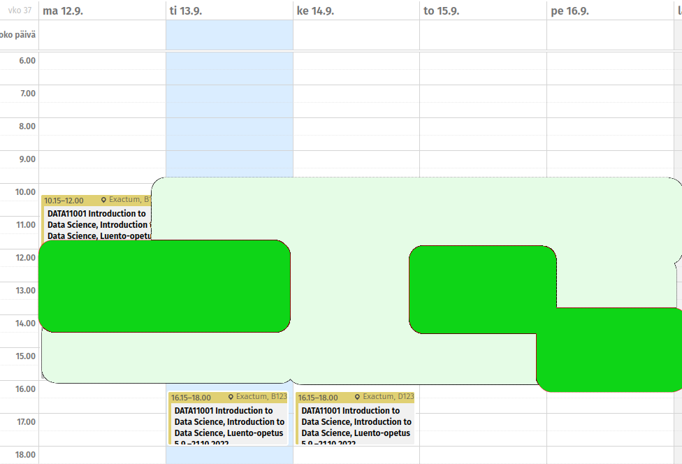

# Intro_to_DS

https://rapidapi.com/hub / 500 ilmaista GET

API: https://rapidapi.com/apidojo/api/online-movie-database/

movie budgets: https://www.the-numbers.com/movie/budgets/all

google trends python package:  
https://lazarinastoy.com/the-ultimate-guide-to-pytrends-google-trends-api-with-python/ (tutorial)  
& https://pypi.org/project/pytrends/

nltk luku tekstin luokittelusta: https://www.nltk.org/book/ch06.html

Sovitut työajat alkuun:

